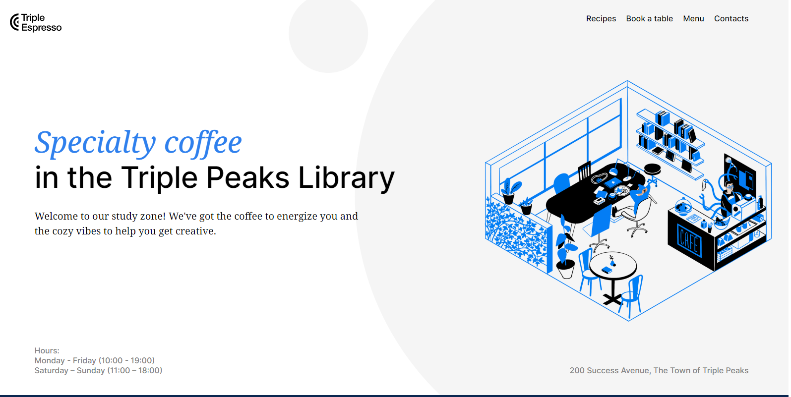
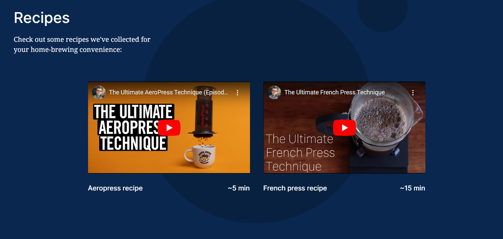
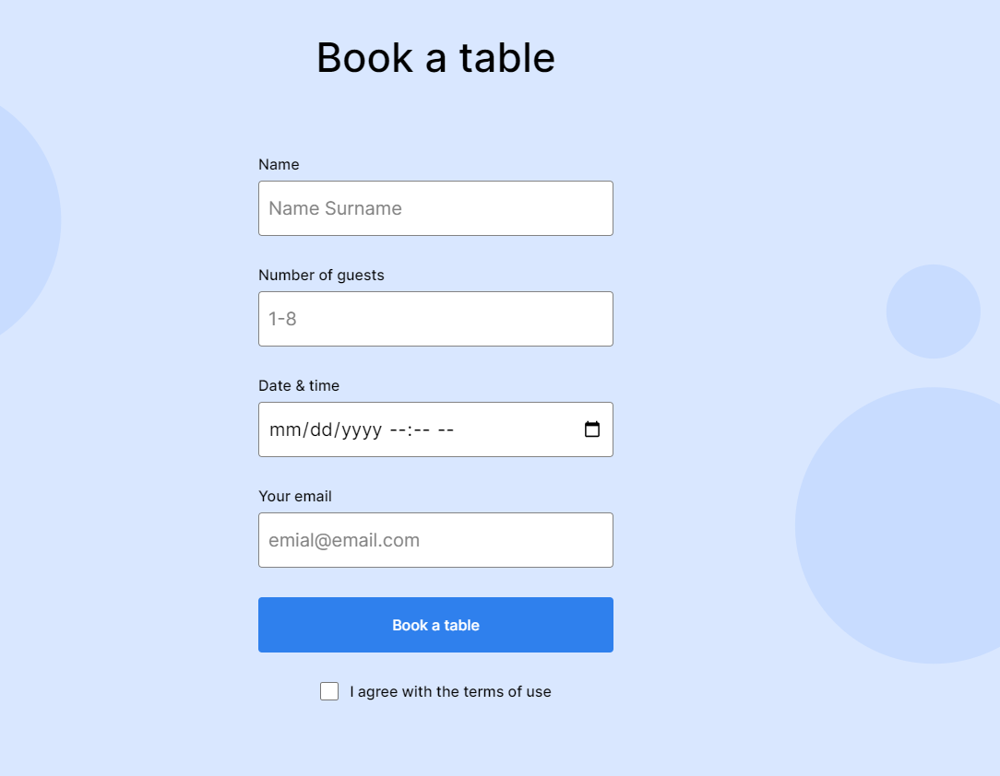

# Triple Peaks Coffee Shop

[Link to the project](https://tj-singh-portfolio.github.io/se_project_coffeeshop/index.html)

## Overview

This is a mock webpage for a coffee shop. It was created using HTML and CSS, based on a design brief.
Technologies and techniques used in this project include:

- Semantic HTML5
- Flexbox
- Positioning
- Flat BEM file structure
- A custom form
- CSS animation and transform
- Use of iframes and Youtube API

## Demo Images

### Plan on improving the project

Animate elements on each page. Eventually create a more advanced form with some JS.
